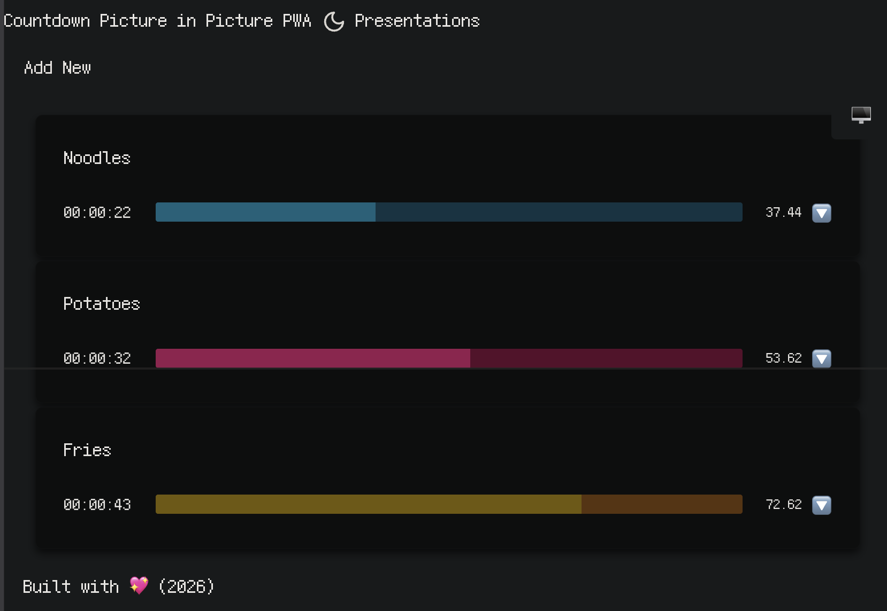
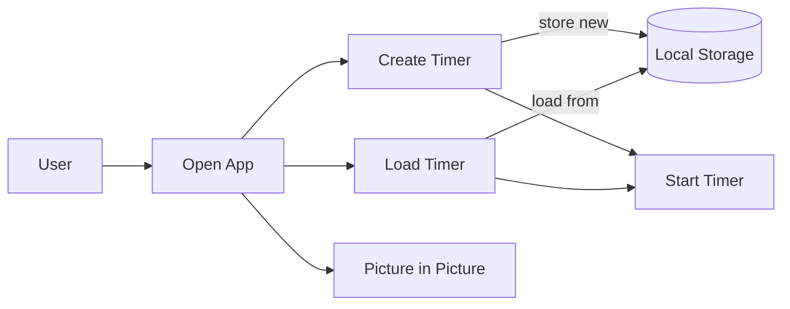

# Gatsby's default starter

Example [Gatsby] website using GitLab Pages.

Learn more about GitLab Pages at https://pages.gitlab.io and the official
documentation https://docs.gitlab.com/ce/user/project/pages/.



## Tags

<!-- Languages, Frameworks, Libraries, Hosting Platforms, CI/CD, IaC, Scripting languages -->

Gatsby, GatsbyJS, DecapCMS, ReactJS, React, JavaScript, HTML, CSS, 
GitHab, GiHub Pages, Typescript, Luxon, Moment.js, PWA, IDB, 
IndexedDB, IDB-KeyVal, React Hooks, Yarn 


## 🍎 Requirements

- Install _[Powershell][pwsh-installation]_
- Install node
  1. Install _[nvm]_ (linux) or `nvm-windows`

  2. ```pwsh
     nvm install "$(cat .nvmrc)"
     nvm use "$(cat .nvmrc)"
     node --version
     npm --version
     ```
  3. Install yarn

     ```pwsh
     npm install --global yarn
     yarn
     ```

[pwsh-installation]: https://learn.microsoft.com/de-de/powershell/scripting/install/installing-powershell?view=powershell-7.5
[nvm]: https://github.com/nvm-sh/nvm
[nvm-windows]: https://github.com/coreybutler/nvm-windows

Kick off your project with this default boilerplate. This starter ships with the main Gatsby configuration files you might need to get up and running blazing fast with the blazing fast app generator for React.

_Have another more specific idea? You may want to check out our vibrant collection of [official and community-created starters](https://www.gatsbyjs.org/docs/gatsby-starters/)._

## ⌨️ Quick start

1. Clone the repository
1. ```pwsh
   # install dependencies
   yarn
   # run local dev server
   yarn run start
   ```

1. Open your browser and visit <http://localhost:8000>
1. To access the admin panel, visit <http://localhost:8000/admin>

> If the URLs wont work, please check configuration for the right port or the URL printed in the console after serving
> it locally.

# Deploy

At the moment, deployment is done manually to the `gh-pages` branch:

```pwsh
yarn run deploy
```

## Spec

The application is very simple

1. Create up/down timer
2. Visualize then in a way to make them picture in picture friendly
3. Persist them so that they automatically continue after a computer restart




## 🎓 Learning Gatsby

Looking for more guidance? Full documentation for Gatsby lives [on the website](https://www.gatsbyjs.org/). Here are some places to start:

- **For most developers, we recommend starting with our [in-depth tutorial for creating a site with Gatsby](https://www.gatsbyjs.org/tutorial/).** It starts with zero assumptions about your level of ability and walks through every step of the process.

- **To dive straight into code samples, head [to our documentation](https://www.gatsbyjs.org/docs/).** In particular, check out the _Guides_, _API Reference_, and _Advanced Tutorials_ sections in the sidebar.


[Gatsby]: https://www.gatsbyjs.org/
